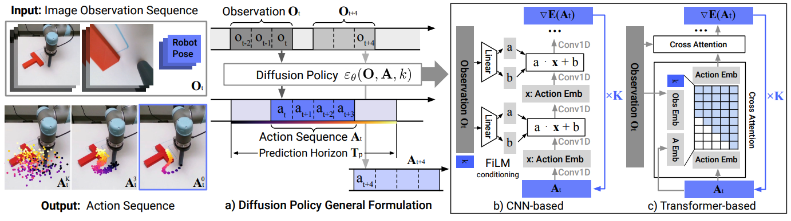
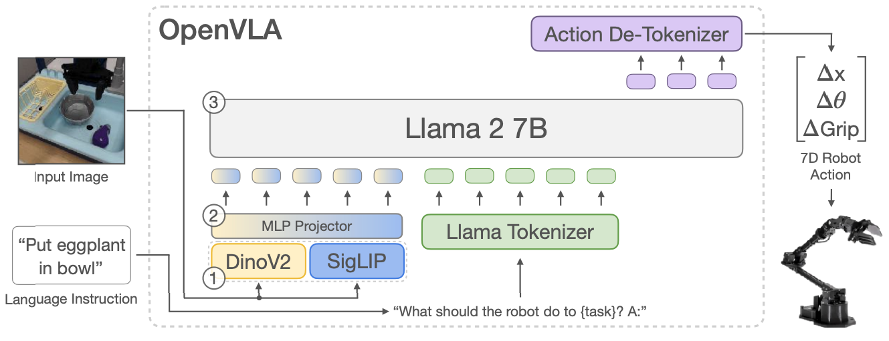
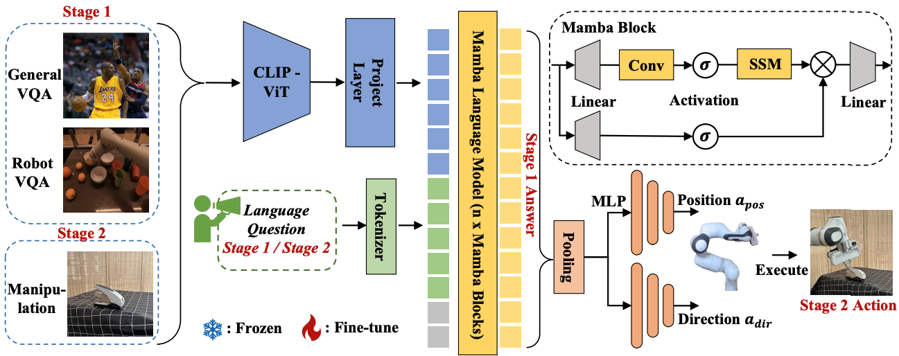

# NERL: Never Ending Robot Learning, an open-source community for embodied foundation models and large-scale datasets

**Explore the Future of Robots with NERL!**

Welcome to NERL (Never-Ending Robot Learning), an ambitious open-source community dedicated to advancing embodied foundation models and large-scale datasets. Our mission is to provide a dynamic ecosystem of continuously growing data, models, and benchmarks that will revolutionize the way robots learn, adapt, and evolve. NERL is where innovation meets collaboration, and we invite researchers, developers, and enthusiasts to contribute their resources and be a part of this journey.

**NERL is constantly evolving:**
1. **Data**: A rich and expanding dataset to fuel robot learning.
2. **Models**: Embodied foundation model toolkits that include state-of-the-art models designed to tackle real-world problems in robotics.
3. **Toolkit**: A complete suite that allows users to seamlessly process data, train models, and evaluate them against state-of-the-art benchmarks in embodied intelligence.
4. **Leaderboard**: Provides a transparent evaluation platform that showcases model performance across various tasks and scenarios, offering benchmark tests for community users.

We believe robots can master general tasks and behaviors by continuously learning from diverse data over time. 

You can follow NERL’s progress right here—explore the latest benchmarks, download datasets, contribute models, and engage with the community in our discussion forum.

NERL is always updating — come and shape the future with us!

## 📢 Preview
🔥 [2024.10] 100w instruction data for Embodied Multimodal Language Model  
🔥 [2024.10] 100w human motion training data for Human Robot Controling   
🔥 [2024.11] 1000w instruction data & Robo-VLM model

## ⭐ Highlights

🌟 Cross-domain and cross-task embodied large models  
🌟 Comprehensive data standards  
🌟 User-friendly end-to-end toolkit, involving data processing, model training and evaluation.

## 🐮 Model

We are preparing __Robo-VLM__. Robo-VLM is an embodied multimodal language model for embodied  scene perception  and interaction task and visual-language tasks. The input of the Robo-VLM contains image, video, 3D scene (RBG-D) and keypoints information, and the the output of the Robo-VLM contains text-based answer and policy planning.

## 🐮 Data
### Integration of Web, Simulation and Real Robot Data
We are collecting and labeling these data for Embodied Multimodal Language Model training.

We are establishing a comprehensive and scalable data framework, categorized into three major sources: Web Data, Simulation Data, and Real Robot Data. This is crucial for continuous robot learning, bridging simulation and real-world application through structured data.

1. **Web Data**: We use open-source datasets like Open X-Embodiment, EGO4d, and EGOEXO4d, emphasizing the relabeling and augmentation of existing datasets as well as the labeling of proprietary data. Web data enables the system to learn from large-scale, real-world examples, expanding the knowledge base for robot learning.

2. **Simulation Data**: This part focuses on data generated in controlled, virtual environments. It includes scene setup, task design, and data generation through advanced simulation platforms such as IsaacGym, Sapien, Brax, and MuJoCo. These environments provide essential training data for robotic tasks without the constraints of physical hardware, enabling rapid iteration and large-scale experiments in robot learning.

3. **Real Robot Data**: The third category involves real-world data, collected from robots performing tasks in designed scenes. This includes detailed information from sensors (cameras, LiDAR, IMUs, force sensors, etc.) and post-processing steps like motion descriptions, key points, and bounding boxes. 

### Unified Data Format

We have established a comprehensive data standard, particularly for real robot data, which is organized into three layers. The first layer is the embodiment and scene layer, where information about the robot and its environment is stored. The second layer consists of time-series data, such as robotic states, actions, and sensor data from devices like cameras, LiDARs, IMUs, and six-axis force sensors. The third layer contains post-processed data for model training, including step descriptions, key points, bounding boxes, and more.

## 🏆 Leaderboard

## 🔧 Model ToolKit

The whole architecture of the toolkit consists of multiple components, including Scene, Data, Model, System and Robot. The Data module contains the data collection and data processing. The Model module contains Robo-VLM and model deployment. All of the data and models are built on the Dora, which is an opensource system.

Overview of the model toolkit

## 📝 Paper List

## 1. Transformer-based

### 1) ACT: https://github.com/tonyzhaozh/act

Learning Fine-Grained Bimanual Manipulation with
Low-Cost Hardware

### 2) RT-1: https://github.com/google-research/robotics_transformer

RT-1: Robotics Transformer for Real-World Control at Scale

### 3) Perceiver-Actor: https://github.com/peract/peract

Perceiver-Actor: A Multi-Task Transformer for Robotic Manipulation

## 2.  Diffusion-based

### 1) Diffusion Policy: https://github.com/real-stanford/diffusion_policy

Diffusion Policy: Visuomotor Policy Learning via Action Diffusion

### 2) 3D Diffusion Policy: https://github.com/YanjieZe/3D-Diffusion-Policy

3D Diffusion Policy: Generalizable Visuomotor Policy Learning via Simple 3D Representations

## 3.  Multimodal Large Langugage Model-based

### 1) OpenVLA: https://github.com/openvla/openvla

OpenVLA: An Open-Source Vision-Language-Action Model

### 2) RoboMamba: https://github.com/lmzpai/roboMamba

RoboMamba: Multimodal State Space Model for Efficient Robot Reasoning and Manipulation

### 3) ManipLLM: https://github.com/clorislili/ManipLLM

ManipLLM: Embodied Multimodal Large Language Model for Object-Centric Robotic Manipulation

### 4) SC-MLLM: https://sites.google.com/view/sc-mllm-web

Self-Corrected Multimodal Large Language Model for End-to-End Robot Manipulation

## 4.  Structure Code-based

### 1) Code as Policies: https://github.com/google-research/google-research/tree/master/code_as_policies

Code as Policies: Language Model Programs for Embodied Control

### 2) VoxPoser: https://github.com/huangwl18/VoxPoser

VoxPoser: Composable 3D Value Maps for Robotic Manipulation with Language Models

## Project Leader
Shanghang Zhang, Mengdi Zhao, Yao Mu, Xavier Tao

## Collaborators
北京人形机器人创新中心，AGILE X Robotics, DORA Robots, LEJU Robot

